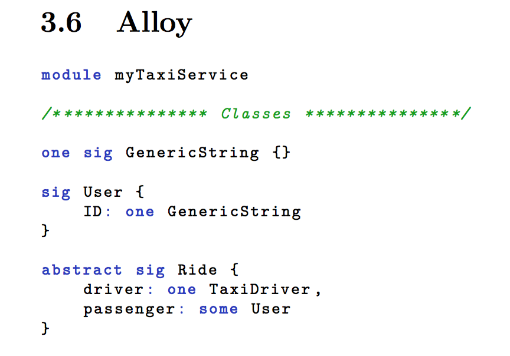

## Alloy Latex Highlighting

Alloy syntax highlighting for the "listings package" (Latex) (It follows MIT's Alloy environment color style).
Based on this  [gist](https://gist.github.com/timvdalen/3796300)

## Preview

## Known Issues

There are some problems with the `=>` symbol.
Just use `implies` instead.

## Installation

Add the dependencies and the .sty file to your main file :

    \usepackage[dvipsnames]{xcolor}
    \usepackage{listings}
    \usepackage{alloy-style}

## How to use

To use it just include you alloy source code where you want :

    \lstinputlisting[language=alloy]{path-to-your-alloy-source-code}

## License

Do what you want with this library.